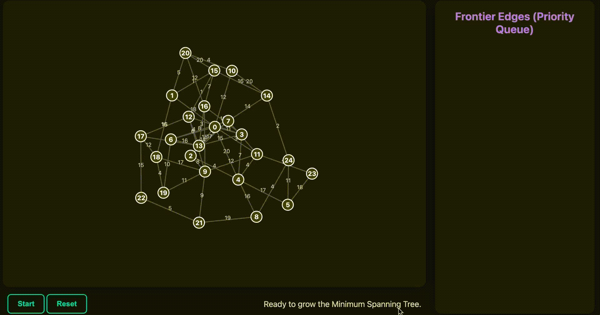

# 🌐 Graph Algorithm Visualizations

A collection of **interactive, web-based visualizations** of classic graph algorithms.  
Each visualization is designed not just to show the *steps* of the algorithm, but also to highlight the **story and intuition** behind it.  

Built with **D3.js**, these self-contained HTML files can be run directly in any modern browser.  

---

## 📑 Table of Contents

1. [Kosaraju's Algorithm: Strongly Connected Components](#-kosarajus-algorithm-strongly-connected-components)
2. [Dijkstra's Algorithm: Shortest Paths](#-dijkstras-algorithm-shortest-paths)
3. [Floyd-Warshall Algorithm: All-Pairs Shortest Paths](#-floyd-warshall-algorithm-all-pairs-shortest-paths)
4. [Kruskal's Algorithm: Minimum Spanning Tree](#-kruskals-algorithm-minimum-spanning-tree-mst)
5. [Prim's Algorithm: Minimum Spanning Tree (Growth from Seed)](#-prims-algorithm-minimum-spanning-tree-mst--growth-from-seed)
6. [A* (A-Star) Pathfinding](#-a-a-star-pathfinding)
7. [Bellman-Ford Algorithm: Negative Weights & Cycle Detection](#-bellman-ford-algorithm-negative-weights--cycle-detection)

---

## 🔹 Kosaraju's Algorithm: Strongly Connected Components

  

**Story & Concept**: Tangled Web → Reversal → Discovery.  
**Features**: Animated DFS passes, finish-order stack, SCC clustering.  
**How to Run**: Save as `kosaraju.html` → Open in browser.  

---

## 🔹 Dijkstra's Algorithm: Shortest Paths

  

**Story & Concept**: *Ripple of Discovery* — shortest paths expand like waves.  
**Features**: Live priority queue, color feedback, weighted edges.  
**How to Run**: Save as `dijkstra.html` → Open in browser.  

---

## 🔹 Floyd-Warshall Algorithm: All-Pairs Shortest Paths

  

**Story & Concept**: Matrix-based dynamic programming, pivot iteration, triangular relaxation.  
**Features**: Live distance matrix, synchronized graph+matrix, interactive path queries.  
**How to Run**: Save as `floyd-warshall.html` → Open in browser.  

---

## 🔹 Kruskal's Algorithm: Minimum Spanning Tree (MST)

  

**Story & Concept**: MST by forest merging, edges accepted/rejected step by step.  
**Features**: Component-based coloring, edge list panel, forest-merging animation.  
**How to Run**: Save as `kruskal.html` → Open in browser.  

---

## 🔹 Prim's Algorithm: Minimum Spanning Tree (MST – Growth from Seed)

  

**Story & Concept**: MST as a growing tree, starting from a seed node and expanding via cheapest frontier edge.  
**Features**: Frontier edges visualization, live priority queue, distinct node/edge states, growth animations.  
**How to Run**: Save as `prim.html` → Open in browser.  

---

## 🔹 A* (A-Star) Pathfinding

  

**Story & Concept**: A* = actual cost g(n) + heuristic h(n). Expands intelligently toward the goal.  
**Features**: Interactive grid (walls, start/end), open/closed set visualization, heuristic-driven expansion, adjustable animation speed.  
**How to Run**: Save as `a-star.html` → Open in browser.  

**Usage Notes:**  
- Draw walls by dragging on the grid.  
- Place start (green) and end (red) dynamically.  
- Click *Start Search* to run A*.  
- Use *Clear Path* or *Reset Grid* for new experiments.  

---

## 🔹 Bellman-Ford Algorithm: Negative Weights & Cycle Detection

  

**Story & Concept**:  
- **Iterative Refinement**: Runs `V-1` rounds of edge relaxations.  
- **Relaxation**: Improves shortest paths step by step.  
- **Negative Edges**: Handles negative weights safely.  
- **Negative Cycle Detection**: Detects cycles with continuous flashing red animation.  

**Features**: Iteration-based animation, live distance list, negative-weight edge highlights, dramatic negative cycle detection.  
**How to Run**: Save as `bellman-ford.html` → Open in browser.  

---

## 🛠️ Technologies Used

- **HTML5**  
- **CSS3**  
- **JavaScript (ES6+)**  
- **D3.js (v7)**  

---

## 📌 Future Improvements

- Step-by-step playback controls.  
- User-defined graphs/weights.  
- Export results (SCCs, paths, MSTs) as JSON/CSV.  
